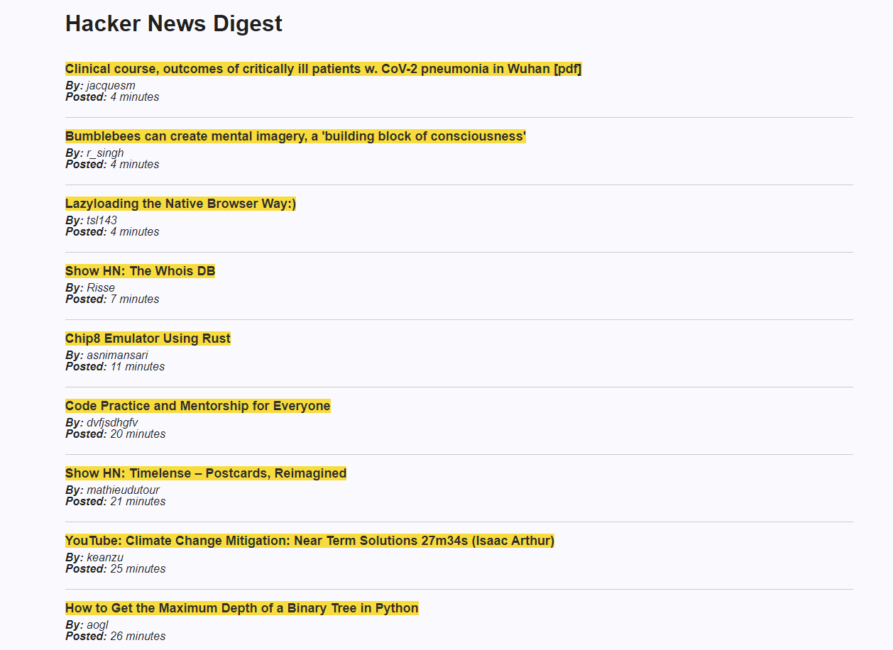

# hacker-news-react

An implementation of hacker news app in react with raw CSS

## **[LIVE DEMO](https://hacker-news-digest.netlify.com)**

## Available Scripts

In the project directory, you can run:

### `npm start`

Runs the app in the development mode. 
Open [http://localhost:3000](http://localhost:3000) to view it in the browser.

The page will reload if you make edits. 
You will also see any lint errors in the console.

